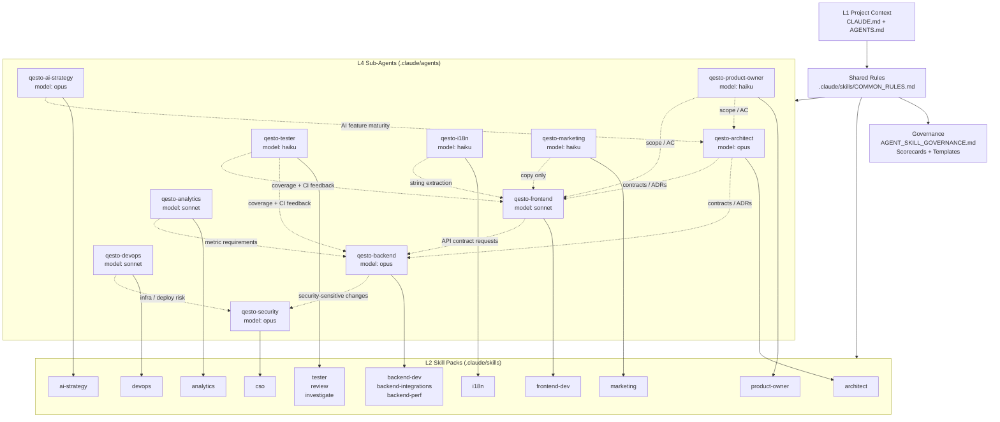
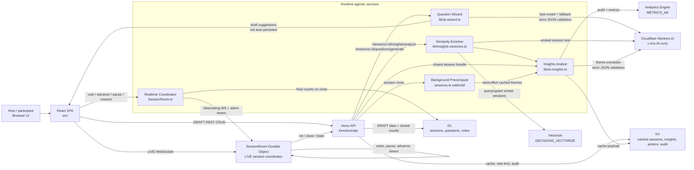

# Qesto Agents Visual Overview

_Hub: [Documentation map](../README.md)._

This overview separates two things that are easy to blur:

- **Development agents**: Claude/Codex role prompts and skill packs in `.claude/`.
- **Runtime agentic services**: product code that coordinates realtime state or calls Workers AI.

Qesto does **not** use external AI APIs for runtime inference. Product AI runs through Cloudflare Workers AI via `c.env.AI.run()`.

## 1. Agent System Map

## 2. Development Agent Inventory

| Agent | Tier | Owns | Escalates to |
|---|---:|---|---|
| `qesto-architect` | Opus | ADRs, API contracts, data model, cross-layer design | Product Owner for scope; Review for code review |
| `qesto-backend` | Opus | `functions/api/`, `worker/`, D1/KV/DO, backend integrations | Architect for contracts; Security for sensitive flows |
| `qesto-security` | Opus | OWASP/STRIDE audits, vulnerability triage, release blockers | Architect/Backend/DevOps by affected domain |
| `qesto-ai-strategy` | Opus | AI feature strategy, maturity scoring, action plans | Architect for implementation architecture |
| `qesto-frontend` | Sonnet | `src/`, React UI, WebSocket UI state, Tailwind | Backend for API contracts; i18n for translations |
| `qesto-devops` | Sonnet | Wrangler config, CI/CD, secrets, Cloudflare operations | Security for secret/risk issues |
| `qesto-analytics` | Sonnet | Analytics Engine queries, dashboards, metrics reports | Backend for instrumentation changes |
| `qesto-tester` | Haiku | Vitest/integration tests, coverage, acceptance verification | Backend/Frontend for implementation defects |
| `qesto-product-owner` | Haiku | Stories, acceptance criteria, prioritization | Architect for technical decisions |
| `qesto-i18n` | Haiku | Translation infrastructure, key extraction, language quality | Frontend for UI integration |
| `qesto-marketing` | Haiku | Copy, CRO, ICP, email/sales materials | Frontend for page implementation |

## 3. Runtime Agentic Services

## 4. Runtime Service Responsibilities

| Service | Code | Trigger | Output | Guardrails |
|---|---|---|---|---|
| Question Wizard | `functions/api/lib/ai-wizard.ts` | `POST /api/sessions/:id/questions/generate` | 3-8 draft questions plus confidence | DRAFT only, rate-limited, strict JSON/Zod validation, suggestions are not auto-saved |
| Insights Analyst | `functions/api/lib/ai-insights.ts` | Manual analyze or close precompute | Theme labels, counts, example excerpts | Closed/archived sessions, plan-gated, no PII, strict JSON/Zod validation |
| Similarity Enricher | `functions/api/lib/insights-vectorize.ts` | Insights analyze | Similar past session titles and stored embedding | Workers AI embeddings, 768-dimensional Vectorize index, best-effort fallback |
| Background Precompute | `functions/api/routes/sessions.ts` | `waitUntil()` after session close | Cached `insights:{sessionId}` payload | Does not delay close response, skips empty input and existing cache |
| Realtime Coordinator | `functions/api/SessionRoom.ts` | LIVE WebSocket and DO internal calls | Live vote state, broadcasts, final counts | Durable Object per session, DRAFT/LIVE split, voter rate limits, alarm-driven debounced broadcasts |

## 5. Source Files

- Development framework: [`CLAUDE.md`](../../../../Qesto/CLAUDE.md), [`.claude/agents/`](../.claude/agents/), [`.claude/skills/`](../.claude/skills/)
- Governance: [`docs/AGENT_SKILL_GOVERNANCE.md`](../AGENT_SKILL_GOVERNANCE.md), [`docs/AGENT_SKILL_SCORECARD.md`](../research/AGENT_SKILL_SCORECARD.md), [`docs/AGENT_SKILL_TEMPLATE.md`](./AGENT_SKILL_TEMPLATE.md)
- Runtime AI: [`functions/api/lib/ai-wizard.ts`](../functions/api/lib/ai-wizard.ts), [`functions/api/lib/ai-insights.ts`](../functions/api/lib/ai-insights.ts), [`functions/api/lib/insights-vectorize.ts`](../functions/api/lib/insights-vectorize.ts)
- Runtime orchestration: [`functions/api/routes/sessions.ts`](../functions/api/routes/sessions.ts), [`functions/api/routes/ai-insights/`](../functions/api/routes/ai-insights/), [`functions/api/SessionRoom.ts`](../functions/api/SessionRoom.ts), [`worker/index.ts`](../worker/index.ts)
