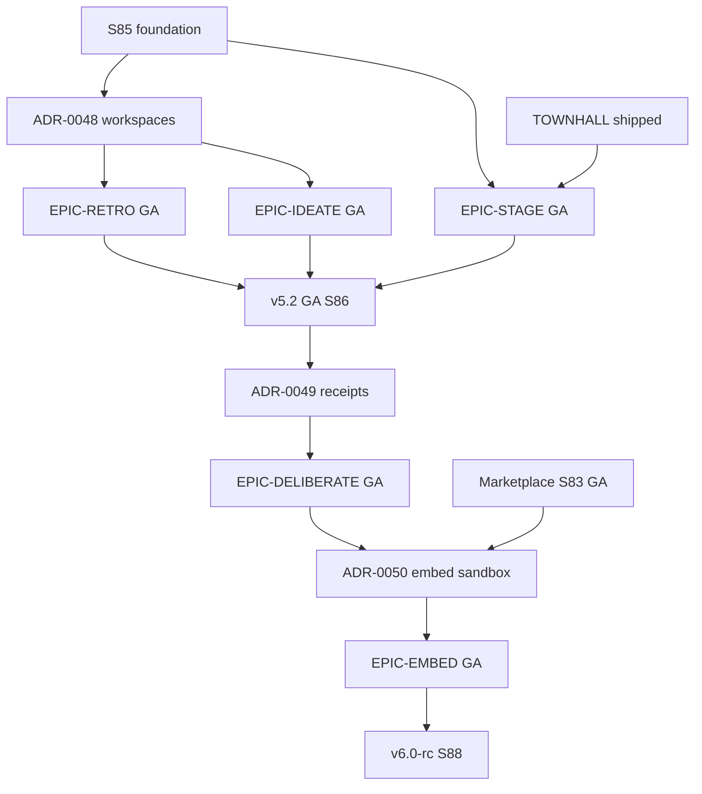

# Next 5 Epics Plan — Post-INSIGHTS+ New-Buyer Expansion (S85–S88)

_Created: 2026-06-05 (UTC). Product Owner synthesis aligned to [`COMPETITIVE_EPICS.md`](../strategy/COMPETITIVE_EPICS.md), [`SPRINT81_85_PLAN.md`](./SPRINT81_85_PLAN.md), and [`SPRINT81_90_PLAN.md`](./SPRINT81_90_PLAN.md)._

_Status: **Proposed — for PO + Architect sign-off.** Promote individual epics into [`BACKLOG_MASTER.md`](../backlog/BACKLOG_MASTER.md) as stories land in sprint planning._

---

## Executive summary

With **v5.0 GA** shipped (Sprint 80), **TOWNHALL** live (ADR-0044), **COPILOT** finishing (S82–S83), and **INSIGHTS+** committed through S85, the platform's next strategic move is to open **five new buyer segments** from the competitive epic set — without re-proposing parity work already on the roadmap (integrations, white-label, mobile PWA).

| # | Epic | Competitive rank | Sprints | Release | New buyer |
|---|------|------------------|---------|---------|-----------|
| 1 | **EPIC-STAGE** — Hybrid Event Engagement Suite | #4 | S85–S86 | v5.2 | Event organizers (#2 lost-deal reason) |
| 2 | **EPIC-RETRO** — Agile Retrospectives & Team Health | #5 | S85–S86 | v5.2 | Engineering / scrum teams |
| 3 | **EPIC-IDEATE** — Brainstorm & Prioritization Board | #6 | S85–S86 | v5.2 | Workshop facilitators / innovation |
| 4 | **EPIC-DELIBERATE** — Verifiable Governance Voting | #7 | S86–S87 | v5.2 → v6.0-rc | Boards, associations, works councils |
| 5 | **EPIC-EMBED** — Engagement SDK & Public Widget API | #10 | S87–S88 | v6.0-rc | Developers, LMSs, streaming tools |

**North-star outcome:** Ship **v5.2 GA** at Sprint 86 close (STAGE + RETRO + IDEATE GA) and **v6.0-rc** at Sprint 88 close (DELIBERATE + EMBED GA), compounding Qesto's four moats on every surface.

**Total estimated scope:** ~420 product-engineering pts across 4 sprints (S85–S88), within the established **120–150 pts/sprint** capacity rule (parallel infra, security, i18n, marketing tracks add separately per role plans).

**Explicitly deferred from this 5-epic slice:** REACTIONS (#8, speculative), CAPTIONS (#9, ASR risk — lands in E88/v6.0-rc per macro plan), CANVAS (★ bonus — parallel S88 track, not counted in the five).

---

## Strategic context

### What's already done or in flight

| Prior epic | Status | Evidence |
|------------|--------|----------|
| TOWNHALL (#1) | ✅ Shipped | `session_mode='townhall'`, ADR-0044; residual TOWNHALL-12 profanity |
| COPILOT (#2) | 🟡 ~95% shipped | ADR-0046; residuals COPILOT-07/08/10 committed S83 |
| INSIGHTS+ (#3) | 🟢 Committed S81–S85 | ADR-0045; 11 stories / ~95 pts |
| Mobile + Marketplace | 🟢 Committed S81–S83 | ADR-0044/0045; v5.1 GA S84 |

### Why these five, in this order

1. **STAGE, RETRO, IDEATE** share the 🟢 near-term cluster (Value 4 / Change 3) — mostly additive on the existing question engine + DO realtime, with foundation work starting S85.
2. **DELIBERATE** is the 🔵 strategic bet — highest moat (zero-knowledge + audit) but Change 4; needs a dedicated ADR and Pentest #5 focus, so it follows the collaboration suite, not precedes it.
3. **EMBED** has the highest TAM ceiling but Change 5 — gated on marketplace monetization confidence (S83) and a hardened public API surface; lands after governance crypto is isolated in its own sprint (do-not-co-land rule).

### Moat alignment

| Moat | Epics that leverage it |
|------|------------------------|
| Edge latency | STAGE (multi-session events @ scale), EMBED (high-throughput widget) |
| Zero-knowledge privacy | RETRO (honest retros), DELIBERATE (verifiable anonymous ballots) |
| Native Workers AI | IDEATE (semantic clustering), RETRO (theme summarization) |
| Reusable question engine | All five — `open`, `upvote`, `ranking`, `consent` types |

---

## Cross-epic architecture

### ADR gates

| ADR | Title | Accept by | Blocks |
|-----|-------|-----------|--------|
| **ADR-0048** | Recurring-workspace data model (RETRO/IDEATE persistence + history) | Mid-S85 | RETRO carryover, IDEATE history, team-health trends |
| **ADR-0049** | Verifiable voting — cryptographic receipt + tally integrity | S86 kickoff | DELIBERATE receipt, re-tally, governance GTM |
| **ADR-0050** | Embeddable SDK auth + widget origin sandboxing | S87 kickoff | EMBED public widget, partner embeds, CORS model |

**Do-not-co-land (inherited from S81–S90):**

- ADR-0049 (verifiable-vote crypto) **must not** land in the same sprint as agent-runtime GA work (ADR-0046 residuals).
- ADR-0050 (third-party embed) **must not** debut in the same RC as marketplace payout changes.

### Dependency graph

### Release milestones

| Release | Sprint close | Epics GA | Marketing claim |
|---------|--------------|----------|-----------------|
| **v5.2** | S86 | STAGE, RETRO, IDEATE | "Qesto for events, agile teams, and workshops" |
| **v5.2.1** | S87 | DELIBERATE | "Verifiable anonymous governance voting" |
| **v6.0-rc** | S88 | EMBED | "Embed Qesto anywhere — SDK + widget API" |

---

## Epic 1 — EPIC-STAGE: Hybrid Event Engagement Suite

**Competitive rank:** #4 · **Value 4 / Change 3** 🟢  
**Goal:** A multi-session **event container** — agenda/track navigation, per-talk speaker ratings, sponsor engagement spots, and attendee networking — for conferences, summits, and large hybrid events.  
**New buyer:** Event organizers (documented **#2 lost-deal reason**).  
**Sprints:** S85 (foundation) → S86 (GA)

### Reuses

- **Find Your Match** energizer (shipped) as networking core
- `SessionRoom` DO for per-talk live sessions
- TOWNHALL Q&A mode for keynote AMA tracks
- SCALE-PROOF evidence (100k voters) for GTM claims
- Team roles + plan middleware for organizer permissions

### Net-new

- `event` entity in D1 (team-scoped container above sessions)
- Agenda/track navigation UI (presenter + attendee)
- Cross-session event dashboard (live status per track)
- Sponsor engagement slots (branded poll/Q&A injection points)
- Event-level analytics rollup (extends INSIGHTS+ patterns)

### Story breakdown (~52 pts)

| ID | Story | Pts | Pri | Sprint | Acceptance signal |
|----|-------|----:|-----|--------|-------------------|
| STAGE-00 | ADR-0047 amendment: event container schema + session linkage model | 3 | P0 | S85 | Architect sign-off; no conflict with TOWNHALL DO |
| STAGE-FOUNDATION-01 | Event workspace: create event, link sessions, organizer role | 13 | P0 | S85 | `POST /api/events`; sessions carry `event_id` FK |
| STAGE-AGENDA-01 | Agenda API + track navigation: ordered sessions per track/day | 8 | P0 | S86 | Attendee sees live agenda; track switch without re-auth |
| STAGE-SUITE-01 | Multi-session orchestration: event-level start/close, live feed | 13 | P0 | S86 | Organizer dashboard shows per-track status |
| FE-STAGE-PRES-01 | Presenter UI: slide-deck hook, live participant feed, Q&A panel | 13 | P1 | S85–S86 | Presenter switches talks within event shell |
| STAGE-SPONSOR-01 | Sponsor engagement slot: branded poll injection per track | 8 | P1 | S86 | Sponsor spot renders on attendee + display views |
| STAGE-NETWORK-01 | Event networking: Find Your Match scoped to event attendees | 5 | P1 | S86 | Match pool = event participants only |
| STAGE-ANALYTICS-01 | Event rollup analytics: per-track engagement + export | 5 | P1 | S86 | JSON/CSV export; extends INSIGHTS export patterns |
| QA-STAGE-E2E-01 | E2E: 3-track event, 500 attendees, track switch + Q&A | 8 | P0 | S86 | Load test passes; p95 track-switch <500ms |
| I18N-STAGE-01 | i18n: agenda, track, sponsor strings in 5 locales | 3 | P1 | S86 | `check:i18n` green |

### Epic acceptance

An event organizer creates a 3-track hybrid event, links live sessions per talk, and attendees navigate the agenda in real time — switching tracks, submitting Q&A in TOWNHALL mode, and matching with other attendees — without leaving the event shell. Event-level analytics export correctly aggregates per-track engagement. Existing single-session flows are unchanged.

### KPIs

| KPI | Target | Measurement |
|-----|--------|-------------|
| Event pilot conversions | ≥3 paid event pilots by S86 close | Sales pipeline + `event.created` AE |
| Track-switch latency | p95 <500ms | AE `event.track_switched` duration |
| Lost-deal recovery | ≥1 event-organizer win attributed to STAGE | CRM tag |

---

## Epic 2 — EPIC-RETRO: Agile Retrospectives & Team Health

**Competitive rank:** #5 · **Value 4 / Change 3** 🟢  
**Goal:** Structured, **recurring** team retrospectives — anonymous "went well / didn't / actions" boards with dot-voting, AI-clustered themes, action items that carry across sprints, and team-mood trend over time.  
**New buyer:** Engineering / scrum / agile teams (EasyRetro, Parabol, TeamRetro adjacency).  
**Sprints:** S85 (foundation) → S86 (GA)

### Reuses

- Anonymity modes (standard + zero-knowledge for sensitive retros)
- `open` + `upvote` question types (dot-voting)
- AI insights theme clustering (`lib/ai-insights.ts`)
- `ACTIONS_KV` for tracked action items
- INSIGHTS+ longitudinal patterns (team-health trends)

### Net-new

- `session_mode='retro'` with fixed column layout (went well / didn't / actions)
- Recurring workspace cadence (weekly/biweekly/sprint-bound)
- Action-item carryover across retro instances
- Team-health longitudinal scorecard (mood + participation trend)
- Retro-specific facilitator templates

### Story breakdown (~55 pts)

| ID | Story | Pts | Pri | Sprint | Acceptance signal |
|----|-------|----:|-----|--------|-------------------|
| RETRO-00 | ADR-0048 acceptance: workspace entity, session history, trend model | 3 | P0 | S85 | Blocks RETRO-02+ |
| RETRO-WORKSPACE-01 | Recurring retro workspace: template, cadence, linked session history | 13 | P0 | S85 | `POST /api/workspaces` with `kind='retro'` |
| RETRO-BOARD-01 | Retro board layout: 3-column capture + anonymous submit | 13 | P0 | S86 | `session_mode='retro'` renders column UI |
| RETRO-DOTVOTE-01 | Dot-voting on action items: upvote cap per participant | 8 | P0 | S86 | Configurable dots; server-enforced cap |
| RETRO-ACTIONS-01 | Action-item carryover: unresolved items pre-seed next retro | 8 | P1 | S86 | `ACTIONS_KV` links workspace → items |
| RETRO-AI-SUMMARY-01 | AI retro summary: cluster themes + suggest action items (Workers AI) | 8 | P1 | S86 | Summary on close; ZK sessions aggregate-only |
| FE-RETRO-HEALTH-01 | Team-health trend UI: mood + participation over N retros | 13 | P1 | S86 | Chart renders with ≥3 retro instances |
| RETRO-EXPORT-01 | Retro export: action items + themes CSV/JSON | 5 | P1 | S86 | Formula-injection safe |
| SEC-WORKSPACE-RBAC-01 | Workspace RBAC: team roles gate create/view/export | 8 | P0 | S85 | Contract tests for owner/member/viewer |
| I18N-RETRO-01 | i18n: retro columns, actions, health labels in 5 locales | 3 | P1 | S86 | `check:i18n` green |

### Epic acceptance

A scrum master creates a recurring retro workspace, runs a retro with anonymous columns and dot-voting, and unresolved action items automatically appear in the next instance. After ≥3 retros, the team-health view shows participation and mood trends (non-ZK only). Zero-knowledge retros never leak per-participant content into aggregates. Export produces action items + clustered themes.

### KPIs

| KPI | Target | Measurement |
|-----|--------|-------------|
| Recurring retro adoption | ≥10 teams create recurring workspace by S86 close | `workspace.created` AE (`kind=retro`) |
| Action-item carryover rate | ≥30% of retros have ≥1 carried item | `retro.action_carried` AE |
| Weekly cadence retention | ≥50% of workspaces run 2nd retro within 14 days | Workspace session count |

---

## Epic 3 — EPIC-IDEATE: Collaborative Brainstorm & Prioritization Board

**Competitive rank:** #6 · **Value 4 / Change 3** 🟢  
**Goal:** Diverge-then-converge ideation — participants submit ideas, AI auto-clusters them into themes, the group dot-votes, and the room ranks priorities live. A facilitation-grade Miro/Stormboard-lite focused on **decisions**, not freeform canvas.  
**New buyer:** Workshop facilitators, innovation/strategy, design-thinking teams.  
**Sprints:** S85 (foundation) → S86 (GA)

### Reuses

- `open` + `upvote` + `ranking` question types
- `DECISIONS_VECTORIZE` for semantic clustering
- AI insights pipeline
- `SessionRoom` DO realtime broadcast
- Workspace model from ADR-0048 (shared with RETRO)

### Net-new

- `session_mode='ideate'` with idea-board UI
- Live cluster visualization (AI-grouped themes updating as ideas arrive)
- Converge-to-priority flow (dot-vote → live ranking reveal)
- Facilitator dashboard (moderate, merge, dismiss ideas)
- IDEATE workspace for multi-session innovation programs

### Story breakdown (~47 pts)

| ID | Story | Pts | Pri | Sprint | Acceptance signal |
|----|-------|----:|-----|--------|-------------------|
| IDEATE-BOARD-01 | Ideate workspace + idea capture board (anonymous optional) | 13 | P1 | S85 | `session_mode='ideate'`; ideas broadcast live |
| IDEATE-CLUSTER-01 | AI live clustering: Vectorize grouping as ideas arrive (debounced) | 13 | P0 | S86 | Cluster bubbles update within 3s of new idea |
| IDEATE-PRIORITIZE-01 | Dot-vote + live ranking reveal: converge flow | 8 | P0 | S86 | Facilitator triggers reveal; ranking broadcasts |
| IDEATE-MERGE-01 | Facilitator merge/dismiss: combine duplicate ideas | 5 | P1 | S86 | Merged idea retains combined vote count |
| FE-IDEATE-DASH-01 | Facilitator dashboard: cluster overview, moderation controls | 8 | P1 | S86 | WCAG 2.1 AA; mobile-first |
| IDEATE-EXPORT-01 | Priority board export: ranked ideas + cluster map JSON/CSV | 5 | P1 | S86 | Plan-gated; formula-injection safe |
| AI-IDEATE-CLUSTER-01 | Workers AI cluster labels: human-readable theme names | 5 | P1 | S86 | No third-party AI; fallback to keyword labels |
| I18N-IDEATE-01 | i18n: ideate board, cluster, prioritize strings in 5 locales | 3 | P1 | S86 | `check:i18n` green |

### Epic acceptance

A facilitator runs a live ideation session: participants submit ideas, AI clusters them into named themes in real time, the group dot-votes, and the facilitator reveals a live priority ranking. Facilitator can merge duplicates without losing votes. Export captures the final ranked list with cluster metadata. Existing poll/ranking sessions are unchanged.

### KPIs

| KPI | Target | Measurement |
|-----|--------|-------------|
| Ideate session adoption | ≥15 ideate sessions in 30 days post-GA | `session.created` AE (`mode=ideate`) |
| Cluster latency | p95 <3s from idea submit to cluster update | AE `ideate.cluster_updated` duration |
| Facilitator NPS | ≥40 (survey sample ≥10) | Post-session micro-survey |

---

## Epic 4 — EPIC-DELIBERATE: Verifiable Anonymous Governance Voting

**Competitive rank:** #7 · **Value 4 / Change 4** 🔵  
**Goal:** Auditable, anonymous decision-making for boards, associations, co-ops, and **works councils** — ranked-choice/approval ballots, quorum rules, voter-verifiable receipts, and a tamper-evident audit trail.  
**New buyer:** Governance / compliance (DACH/NL works councils; EU residency moat).  
**Sprints:** S86 (foundation) → S87 (GA)

### Reuses

- `consent` + `ranking` question types
- `AUDIT_KV` + audit viewer
- Zero-knowledge anonymity mode (ADR-0010)
- CMK envelope (ADR-0041) for tally signing
- DECISIONS store for ballot records

### Net-new

- Per-ballot cryptographic commitment (SHA-256 + nonce)
- Append-only audit ledger with Merkle root tally
- Voter-verifiable receipt UX
- Quorum + eligibility rules engine
- Independent re-tally verification endpoint

**Not in scope:** Blockchain, on-chain voting, or token-based consensus (per S81–S90 out-of-scope list).

### Story breakdown (~68 pts)

| ID | Story | Pts | Pri | Sprint | Acceptance signal |
|----|-------|----:|-----|--------|-------------------|
| DELIBERATE-00 | ADR-0049 acceptance: commitment scheme, Merkle tally, receipt format | 3 | P0 | S86 | Cryptography review scheduled |
| DELIBERATE-RECEIPT-01 | Ballot commitment + receipt generation on vote submit | 21 | P0 | S86 | Receipt contains nonce + commitment hash |
| DELIBERATE-TALLY-01 | Session-close Merkle root publish + signed tally | 13 | P0 | S86 | Tally independently re-computable |
| DELIBERATE-QUORUM-01 | Quorum + eligibility rules: min voters, role gates | 8 | P0 | S87 | Ballot rejected if quorum unmet |
| FE-DELIBERATE-VERIFY-01 | Voter receipt UX: verify ballot inclusion post-close | 13 | P0 | S86 | Participant verifies receipt against published root |
| DELIBERATE-RETALLY-01 | Public re-tally endpoint: observer verifies result | 8 | P0 | S87 | Third party re-tallies without platform trust |
| DELIBERATE-GA-01 | Governance session mode: ranked-choice + approval ballots | 13 | P0 | S87 | `session_mode='governance'` live |
| SEC-VOTE-INTEGRITY-01 | Security: receipt forgery, replay, coercion-resistance tests | 13 | P0 | S86–S87 | Pentest #5 prep; zero critical findings |
| DELIBERATE-EXPORT-01 | Audit-grade export: tally proof + ballot ledger (redacted) | 8 | P1 | S87 | Plan-gated; governance tier |
| I18N-DELIBERATE-01 | i18n: receipt, quorum, verify strings in 5 locales | 3 | P1 | S87 | `check:i18n` green |

### Epic acceptance

A works council runs an anonymous ranked-choice ballot with quorum rules. Each voter receives a verifiable receipt. After close, an independent observer re-tallies from the published Merkle root and confirms the result matches the platform tally. Zero-knowledge mode ensures no per-voter identity is recoverable from broadcasts. Governance tier is plan-gated. No blockchain dependency.

### KPIs

| KPI | Target | Measurement |
|-----|--------|-------------|
| Re-tally verification | 100% of test ballots independently verifiable | QA + external crypto review |
| Governance pilot | ≥2 pilots (association or works council) by S87 close | Sales pipeline |
| Pentest #5 vote integrity | 0 critical/high findings | Security sign-off |

### Risk gate

**ADR-0049 must pass independent cryptography review** before DELIBERATE-GA-01 ships. If review finds fundamental flaws, defer GA to S88 and ship receipt-only beta in S87.

---

## Epic 5 — EPIC-EMBED: Engagement SDK & Public Widget API

**Competitive rank:** #10 · **Value 4 / Change 5** 🟡→committed  
**Goal:** Make Qesto a **platform** — embeddable poll/Q&A widgets and a public, usage-metered API/SDK so product teams, LMSs, and streaming tools drop Qesto engagement into their surfaces.  
**New buyer:** Developers, LMS integrators, streaming platforms (highest TAM ceiling).  
**Sprints:** S87 (foundation) → S88 (GA)

### Reuses

- Existing REST API surface (`functions/api/`)
- Entitlements + usage metering (`planMiddleware`)
- Stripe billing for API usage tiers
- `SessionRoom` DO for realtime widget sessions
- Rate limiting + circuit breakers (ADR-0007)

### Net-new

- Public API v3 (versioned, documented, rate-limited)
- Embeddable widget (`<script>` + iframe isolation)
- Scoped embed tokens (short-lived, origin-bound)
- JavaScript SDK (`@qesto/embed`)
- Developer console (API keys, origin allowlist, usage dashboard)
- CORS + `frame-ancestors` sandbox model

### Story breakdown (~72 pts)

| ID | Story | Pts | Pri | Sprint | Acceptance signal |
|----|-------|----:|-----|--------|-------------------|
| EMBED-00 | ADR-0050 acceptance: embed token model, origin sandbox, postMessage contract | 3 | P0 | S87 | Security review of origin model |
| EMBED-SDK-01 | `@qesto/embed` JS SDK: init, create session, render poll widget | 21 | P0 | S87 | npm package; tree-shakeable |
| EMBED-WIDGET-API-01 | Widget server: isolated origin, scoped tokens, session proxy | 13 | P0 | S87 | Widget loads on third-party origin |
| EMBED-API-V3-01 | Public API v3: versioned routes, OpenAPI spec, rate limits | 13 | P0 | S87 | 100 req/min default; plan-tier overrides |
| FE-EMBED-PLAYGROUND-01 | Developer console: API keys, origins, usage, test embed | 13 | P1 | S87–S88 | Team admin can create/revoke keys |
| SEC-EMBED-ORIGIN-01 | Origin allowlist + clickjacking/XSS hardening | 8 | P0 | S87 | Pentest #5 embed surface |
| CONTRACT-EMBED-SDK-01 | Contract tests: SDK init, vote, token expiry, origin deny | 8 | P0 | S88 | CI green |
| EMBED-METERING-01 | Usage metering: API call counts → billing ledger | 8 | P1 | S88 | Overage alerts; plan upgrade CTA |
| EMBED-DOCS-01 | Developer docs: quickstart, SDK reference, widget cookbook | 5 | P1 | S88 | Published at `/developers` |
| I18N-EMBED-01 | i18n: widget default strings in 5 locales | 3 | P1 | S88 | Host can override locale |

### Epic acceptance

A developer signs up, creates an API key with an origin allowlist, embeds a live poll widget on their site via `@qesto/embed`, and participants vote without leaving the host page. Tokens expire and are origin-bound. Usage is metered and plan-gated. Contract tests cover init, vote, token expiry, and origin denial. No account JWT is exposed to the widget.

### KPIs

| KPI | Target | Measurement |
|-----|--------|-------------|
| Developer signups | ≥25 dev accounts with API keys in 30 days | `embed.api_key_created` AE |
| Widget embed activations | ≥50 live embeds | `embed.widget_loaded` AE |
| API error rate | <0.5% 5xx on public API v3 | OTel dashboard |

### Risk gate

**ADR-0050 origin sandbox must pass Pentest #5** before public GA. If critical XSS/token-leak findings emerge, ship SDK-only (no iframe widget) in S88 and defer widget GA to S89.

---

## Sprint allocation summary

| Sprint | Window (indicative) | Epics | Pts (product eng.) | Release |
|--------|---------------------|-------|-------------------|---------|
| **S85** | 2026-07-28 → 2026-08-10 | STAGE foundation, RETRO/IDEATE foundation, ADR-0048 | ~140 (incl. INSIGHTS closeout per S81–85 plan) | v5.1.1 patch |
| **S86** | 2026-08-11 → 2026-08-24 | STAGE GA, RETRO GA, IDEATE GA, DELIBERATE foundation | ~145 | **v5.2 GA** |
| **S87** | 2026-08-25 → 2026-09-07 | DELIBERATE GA, EMBED foundation | ~140 | v5.2.1 |
| **S88** | 2026-09-08 → 2026-09-21 | EMBED GA | ~141 | **v6.0-rc** |

**Capacity note:** Tables above are product-engineering slices only. Add parallel tracks per [`SPRINT81_90_INFRA_PLAN.md`](./SPRINT81_90_INFRA_PLAN.md), [`SPRINT81_90_SECURITY_PLAN.md`](./SPRINT81_90_SECURITY_PLAN.md), and role plans for full sprint load.

---

## Cross-epic quality gates

| Gate | Complete by | Blocks |
|------|-------------|--------|
| ADR-0048 (workspace model) accepted | Mid-S85 | RETRO carryover, IDEATE history |
| v5.2 RC staging pass (zero P0 bugs 48h) | Mid-S86 | v5.2 GA |
| ADR-0049 cryptography review passed | End of S86 | DELIBERATE GA |
| Pentest #5 prep complete (governance + embed) | S87 kickoff | DELIBERATE + EMBED public surfaces |
| Verifiable-vote independent re-tally demo | S87 | DELIBERATE GTM |
| Pentest #5 critical/high = 0 | End of S88 | v6.0-rc embed claim |
| `check:compliance-claims` green | Every sprint | All public copy |
| `npm test` + `tsc --noEmit` green | Every story | Merge gate |

---

## Risk register

| Risk | Likelihood | Impact | Mitigation |
|------|------------|--------|------------|
| ADR-0048 workspace model conflicts with session lifecycle | Medium | High | Architect spike in S85 week 1; no D1 migration without dry-run |
| STAGE + RETRO + IDEATE overload S86 | Medium | Medium | STAGE foundation in S85; IDEATE clustering can slip to S86 stretch |
| DELIBERATE crypto scheme rejected in review | Low | High | Receipt-only beta in S87; full GA slips to S88 |
| EMBED XSS via third-party origins | Medium | Critical | ADR-0050 strict origin sandbox; Pentest #5 dedicated embed surface |
| Recurring workspace GDPR retention ambiguity | Medium | Medium | Privacy review in ADR-0048; anonymized aggregates only in trends |
| Event-organizer GTM without Zoom integration | Medium | Low | STAGE ships with REST agenda; Zoom-01 remains separate backlog item |

---

## Marketing & GTM sequencing

| Sprint | Campaign | ICP | Key message |
|--------|----------|-----|-------------|
| S86 | v5.2 launch | Event organizers + agile teams | "One platform for your conference, retro, and workshop" |
| S87 | Governance teaser | Works councils / associations | "Vote anonymously. Verify independently." |
| S88 | Developer launch | Product teams / LMS | "Embed live engagement in 5 lines of code" |

Re-run [`MARKET_PULSE_TO_BACKLOG_WORKFLOW.md`](../MARKET_PULSE_TO_BACKLOG_WORKFLOW.md) at **S85 kickoff** and **S87 midpoint** to validate ICP priority.

---

## PO sign-off checklist

Before S85 epic work begins (beyond foundation stories already committed):

- [ ] Confirm INSIGHTS+ epic complete per S81–S85 exit criteria
- [ ] ADR-0048 in Architect acceptance queue (target: mid-S85)
- [ ] Promote EPIC-STAGE, EPIC-RETRO, EPIC-IDEATE sections in BACKLOG_MASTER with story IDs above
- [ ] Schedule ADR-0049 cryptography review (external) for S86 week 1
- [ ] Security confirms Pentest #5 scope includes governance + embed surfaces
- [ ] Legal reviews DELIBERATE governance claims before S87 GTM
- [ ] Each epic cap verified ≤150 pts/sprint in tracker
- [ ] Marketing confirms v5.2 launch date aligns with S86 close
- [ ] This plan signed by PO + Architect

---

## Appendix: Relationship to macro S81–S90 plan

This document is the **fine-grained epic plan** for competitive epics #4–7 + #10, corresponding to sprint epics **E84–E87** in [`SPRINT81_90_PLAN.md`](./SPRINT81_90_PLAN.md):

| Macro epic | This plan | Notes |
|------------|-----------|-------|
| E84 — Town Hall & Hybrid Events | EPIC-STAGE | TOWNHALL already shipped; STAGE is the net-new event container |
| E85 — Continuous Collaboration | EPIC-RETRO + EPIC-IDEATE | Split into two epics for backlog traceability |
| E86 — Verifiable Governance | EPIC-DELIBERATE | 1:1 mapping |
| E87 — Embeddable Platform | EPIC-EMBED | 1:1 mapping |
| E88 — Adaptive Experience | _Out of scope_ | CANVAS + CAPTIONS remain in macro plan S88–S89 |

**Bonus epic (not in the five):** CANVAS (★) — session themes + adaptive dataviz — ships parallel in S88 per macro plan; compounds all five epics' presentation value.
