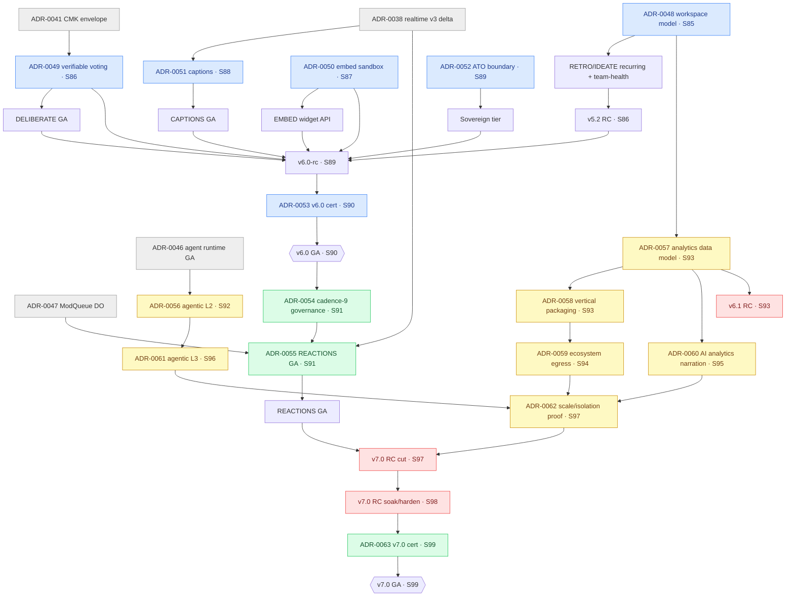

# Sprint 85–99 Architecture Notes & ADR Brief — 9-Day Cadence Re-plan toward v7.0

_Prepared: 2026-06-11 — Architect synthesis for the S85→S99 arc, re-baselined onto a **9-working-day** sprint cadence. Continues [`SPRINT81_90_ARCH_NOTES.md`](./SPRINT81_90_ARCH_NOTES.md). This is a **planning brief**; each ADR document is authored to `/knowledge-base/adr/ADR-00NN-*.md` only when accepted._

_Baseline at re-plan: **v5.1.0 GA shipped at S84**. The accepted S81–S90 ADR ladder runs to **ADR-0053** (v6.0 platform certification, S90). The S85→S90 window (ADR-0048 → ADR-0053) is already specified in the prior brief and is **carried, not re-authored, here** — this document governs the cadence change across the whole arc and introduces the **net-new ADR-0054 → ADR-0063** ladder for the S91–S99 horizon toward **v7.0**._

> **Scope guard.** The net-new S91–S99 epic *content* (REACTIONS GA, agentic/AI maturity, new verticals, an analytics product, ecosystem depth) is being authored in parallel by market-research. This brief deliberately provides **labeled ADR slots** and a release/gate backbone those epics map onto — it does **not** hard-code epic names or final scope. Where an ADR slot is content-dependent it is marked **[SLOT]**.

---

## Architectural thesis

S81–S90 spent the certified v5.0 platform on **reach, economy, and new buyers** and closes on **v6.0 GA** (S90): native mobile, marketplace economy, agent runtime GA, town-hall/hybrid events, recurring workspaces, verifiable governance, embeddable SDK, captions, and a gov-cloud/sovereign data plane.

S85→S90 is the **back half of that arc** (continuous collaboration → verifiable governance → embed → adaptive/AAA → gov ATO → v6.0 cert). S91→S99 is **net-new horizon**: it does not open a fresh set of trust boundaries the way S81–S90 did — instead it **deepens and operationalizes** surfaces that shipped as v1: REACTIONS to GA, the agent runtime from "sandboxed tool-caller" toward **higher autonomy maturity**, the new-business epics into **named verticals**, results/insights into a **first-class analytics product**, and the marketplace/embed into **ecosystem depth** (richer extension points, partner data flows). It closes on a **v7.0-rc (S97–S98) → v7.0 GA (S99)**.

The architectural risk profile therefore **shifts again**: from *opening new trust boundaries* (S81–S90) to *raising the autonomy, data-aggregation, and third-party-data ceilings on boundaries that already exist*. Higher agent autonomy, cross-session/cross-team analytics aggregation, and ecosystem data egress are each a **re-escalation of an existing surface**, not a greenfield one — so the ADR cadence here is **per-escalation**, and the do-not-co-land discipline extends to keeping any two autonomy/data-escalations out of the same RC.

**Invariants preserved across the arc (unchanged, non-negotiable):** Workers AI only (no third-party AI egress); secrets via `wrangler pages secret put`; DRAFT-API vs WebSocket separation; multi-tenant isolation; GDPR-by-default; verifiable-vote correctness (ADR-0049) never weakened by analytics aggregation. No ADR in this arc may weaken these.

---

## 1. Cadence recalibration — 10-working-day → 9-working-day sprints

### What changed

| Dimension | S81–S90 (old) | S85–S99 (new) | Implication |
|-----------|---------------|---------------|-------------|
| Sprint length | 10 working days (2-week) | **9 working days** | Each sprint is one working day shorter |
| Committed capacity | 120–150 pts | **120–150 pts (retained)** | Same throughput in less calendar |
| Per-working-day load | 12–15 pts/day | **13.3–16.7 pts/day** | **+~11% per-day load** (10/9 = 1.111…) |
| Ceremony overhead share | fixed ~1 day (plan+review+retro) | fixed ~1 day | Ceremony now consumes **~11% vs ~10%** of the sprint — net dev days fall from ~9 to ~8 |

### The real squeeze: net development days, not headline points

The headline "+11% per-day load" understates the effect. Sprint ceremonies (planning, review, retro, refinement) are roughly **fixed at ~1 working day** regardless of sprint length. On a 10-day sprint that leaves **~9 net dev days**; on a 9-day sprint it leaves **~8 net dev days** — a **~11% drop in net build time** carrying the **same 120–150 pts**. Effective build-day load rises closer to **+12.5%** (9/8), not +11%.

**Architectural consequence:** the squeeze lands hardest on work that does not parallelize — RC stabilization, pentest remediation loops, and DO/protocol soak. These are *serial* by nature; you cannot buy back a compressed soak window with more people. The mitigations below protect those serial windows specifically.

### Indicative S85→S99 calendar (9-working-day spacing)

Following the prior docs' **accelerated-calendar convention** (the S81–S90 plan anchored "2-week sprints after S80 @ 2028-02-18"; consistency with that convention matters more than real-world dates). Here each sprint spans **9 working days ≈ 13 calendar days** (9 working + 2 weekends, no holiday modeling). Anchor: **S85 begins 2028-04-10** (continuous with the prior calendar's S85 neighborhood; exact day chosen for clean 9-day stepping).

| Sprint | Window (indicative, 9 working days) | Release milestone |
|--------|-------------------------------------|-------------------|
| S85 | 2028-04-10 → 2028-04-21 | RETRO/IDEATE foundation |
| S86 | 2028-04-24 → 2028-05-05 | v5.2 RC |
| S87 | 2028-05-08 → 2028-05-19 | Embed + governance GA |
| S88 | 2028-05-22 → 2028-06-02 | Adaptive + captions |
| S89 | 2028-06-05 → 2028-06-16 | v6.0 RC + full ATO |
| S90 | 2028-06-19 → 2028-06-30 | **v6.0 GA** |
| S91 | 2028-07-03 → 2028-07-14 | [SLOT] net-new horizon opens |
| S92 | 2028-07-17 → 2028-07-28 | [SLOT] |
| S93 | 2028-07-31 → 2028-08-11 | [SLOT] / v6.1 RC candidate |
| S94 | 2028-08-14 → 2028-08-25 | [SLOT] |
| S95 | 2028-08-28 → 2028-09-08 | [SLOT] |
| S96 | 2028-09-11 → 2028-09-22 | [SLOT] / v6.2 RC candidate |
| S97 | 2028-09-25 → 2028-10-06 | v7.0 RC (cut) |
| S98 | 2028-10-09 → 2028-10-20 | v7.0 RC (soak/harden) |
| S99 | 2028-10-23 → 2028-11-03 | **v7.0 GA** |

> The S85–S90 windows above are the 9-day re-spacing of the *same* milestones already specified in `SPRINT81_90_PLAN.md`; their ADRs (0048–0053) and gates are unchanged in content, only re-dated onto 9-day stepping. S91–S99 milestones carry **[SLOT]** until market-research finalizes epic content.

### Risk to QA / RC soak windows, and mitigation

The compressed cadence threatens four serial, non-parallelizable windows. Each gets an explicit mitigation:

| Risk under 9-day cadence | Why it bites | Mitigation |
|--------------------------|--------------|------------|
| **RC soak compression** — a single-sprint RC now soaks ~8 dev days, not ~9 | Soak finds late-breaking realtime/DO regressions that unit tests miss; one fewer day = fewer overnight soak cycles | **Two-sprint RC for every major** (`-rc` cut in sprint *N-1*, GA in *N*). Applies to v6.0 (S89→S90) and v7.0 (S97/S98→S99). Minor/dot releases may stay single-sprint only if no DO/protocol/crypto/auth surface changed. |
| **Pentest remediation loop** | Pentest find→fix→re-test is serial; an 11% shorter sprint shortens the fix window for criticals | **Open pentests one sprint earlier** than the old cadence would (prep in *N-2*), and treat critical/high remediation as a **release-blocking gate decoupled from the sprint boundary** — RC does not cut until crit/high = 0 regardless of sprint clock. |
| **DO/protocol soak** (realtime correctness) | DO regressions surface under sustained connection churn, not in CI; needs wall-clock soak | **Realtime/DO protocol governance gate** (see §4): any sprint touching SessionRoom/AgentRunDO/ModQueueDO requires a staging WS smoke + 24h soak *started no later than mid-sprint* so it completes before RC. |
| **Compliance-claims & eval gate crunch** | `check:compliance-claims` and `npm run test:eval` are end-of-sprint gates; compression pushes them against the wall | Make both **continuously-green, not end-of-sprint** — run on every PR touching copy/prompts/schemas. A compressed sprint cannot afford a big-bang gate run on day 8. |

**Net guidance:** absorb the +11–12.5% per-build-day load by (a) *not* growing per-sprint pts above 150, (b) reserving serial windows (RC soak, pentest remediation, DO soak) as protected and starting them earlier in-sprint, and (c) converting end-of-sprint gates into continuous PR gates so the compressed tail is not where correctness is first checked.

---

## 2. ADR calendar

### Carried (already specified in SPRINT81_90_ARCH_NOTES.md — re-dated onto 9-day cadence, content unchanged)

| ADR | Title | Accept | Blocks |
|-----|-------|--------|--------|
| ADR-0048 | Recurring-workspace data model (RETRO/IDEATE persistence + history) | S85 | Team-health trends, recurring-buyer GTM |
| ADR-0049 | Verifiable voting — cryptographic receipt + tally integrity | S86 | DELIBERATE governance tier |
| ADR-0050 | Embeddable SDK auth + widget origin sandboxing | S87 | EMBED public widget API |
| ADR-0051 | Live captions/translation pipeline (Workers AI ASR + MT) | S88 | CAPTIONS GA |
| ADR-0052 | FedRAMP Moderate full ATO boundary + sovereign data plane | S89 | Gov GTM, sovereign tenant tier |
| ADR-0053 | v6.0 platform certification + v5.x deprecation policy | S90 | v6.0 GA ship |

### NET-NEW (S91–S99 horizon toward v7.0) — ADR-0054 onward

These ADR slots are designed to absorb ~6–9 net-new epics (REACTIONS GA, agentic/AI maturity, new verticals, analytics product, ecosystem depth) without hard-coding epic names. Slots marked **[SLOT]** are content-dependent and finalized when market-research lands the epic set; their architectural *shape* (the trust/data surface each governs) is fixed here so the dependency and do-not-co-land backbone holds regardless of final naming.

| ADR | Title | Accept | What it blocks / governs |
|-----|-------|--------|--------------------------|
| **ADR-0054** | **v6.x post-GA stabilization + cadence-9 governance** — ratifies the 9-day cadence, two-sprint RC rule, continuous-gate policy, and v6.x hotfix/backport lane | **S91** | Everything in S91–S99 (process backbone); first net-new build sprint |
| **ADR-0055** | **REACTIONS GA — live reaction/emote channel at scale** — high-frequency low-payload broadcast over realtime v3 delta; per-session rate budget; abuse/flood control; no de-anon | **S91** | REACTIONS GA; rides ADR-0038 realtime v3; coordinates with ModQueueDO (ADR-0047) backpressure |
| **ADR-0056 [SLOT]** | **Agentic maturity L2 — bounded multi-step autonomy + human-in-the-loop checkpoints** — raises agent runtime (ADR-0046) from single-tool-call to supervised plans; expanded but still-whitelisted tool surface; approval gates on state-mutating actions | **S92** | Higher-autonomy facilitation; gated on extended agent safety eval (SEC-AGENT-EVAL-02) |
| **ADR-0057 [SLOT]** | **Analytics product data model — cross-session / cross-team aggregation plane** — read-optimized aggregation store; tenant-isolated; anonymity-preserving rollups; retention/GDPR for longitudinal data; reuses workspace model (ADR-0048) | **S93** | Analytics product GA; benchmark/trend features; v6.1 RC candidate |
| **ADR-0058 [SLOT]** | **Vertical packaging & tenant configuration surface** — per-vertical templates, defaults, compliance posture, and feature-gating without per-vertical code forks; config-as-data not code | **S93** | New named verticals; vertical GTM; must not fork multi-tenant isolation |
| **ADR-0059 [SLOT]** | **Ecosystem depth — extension data contracts + partner data egress governance** — richer marketplace/embed extension points with explicit, consented, scoped data flows out of the platform; egress allowlist + audit | **S94** | Deeper partner integrations; data-out features; high data-trust surface |
| **ADR-0060 [SLOT]** | **Analytics insight intelligence — Workers-AI analytics narration + anomaly surfacing** — AI layer over ADR-0057 aggregation plane; output-schema validated; eval-gated; Workers AI only | **S95** | AI analytics features; gated on `test:eval` golden fixtures |
| **ADR-0061 [SLOT]** | **Agentic maturity L3 — delegated autonomy boundary + audit/escalation** — defines the *maximum* autonomy ceiling, hard kill-switch, full action audit, and tenant opt-in; the autonomy "do not exceed" line for v7.0 | **S96** | Top agentic tier; gated on Pentest #6 agent-abuse scope + SEC-AGENT-EVAL-03 |
| **ADR-0062 [SLOT]** | **Ecosystem/analytics scale & isolation proof** — load + isolation evidence for the new aggregation and egress planes at v7.0 scale; sovereign-tier exclusion confirmation | **S97** | v7.0 RC; scale/isolation marketing claims |
| **ADR-0063** | **v7.0 platform certification + v6.x deprecation policy** — certification bundle (SOC 2 Type II annual, Pentest #5/#6 evidence, DR drill, AAA conformance), 9-day-cadence release-quality attestation, v6.x sunset timeline | **S99** | v7.0 GA ship |

> **Slot mapping note for market-research:** there are **10 net-new ADR slots (0054–0063)**, of which 0054/0055/0063 are fixed (process + REACTIONS + v7 cert) and **seven (0056–0062)** are content-mappable across the ~6–9 net-new epics. If fewer than seven net-new architectural surfaces materialize, collapse adjacent `[SLOT]` ADRs (e.g. fold 0058 vertical packaging into 0057 analytics data model) rather than renumber the fixed bookends.

### Do-not-co-land discipline extended into S91–S99

The S81–S90 rule kept the two highest-risk **net-new trust surfaces** out of the same sprint. For S91–S99 the rule extends to keeping any two **autonomy or data-aggregation escalations** out of the same RC, because they re-escalate existing surfaces and would split pentest/eval attention.

| Must not co-land | Reason |
|------------------|--------|
| **ADR-0056 (agentic L2 autonomy) + ADR-0057 (cross-tenant analytics aggregation)** | Two simultaneous escalations of *what the system may do autonomously* and *how much tenant data it aggregates* — both are top eval/pentest targets and couple unrelated correctness/isolation failures in one RC. |
| **ADR-0059 (partner data egress) + ADR-0060 (AI analytics narration)** | Data leaving the platform (egress) and AI summarizing aggregated tenant data should not debut together — isolate data-out trust from AI-output trust so a leak is attributable to one surface. |
| **ADR-0061 (agentic L3 delegated autonomy) + any [SLOT] data-egress or analytics-AI GA in the same sprint** | L3 is the autonomy ceiling and the arc's top risk; it must own its RC's pentest/eval focus alone, as ADR-0046 did in S81–S90. |
| **ADR-0062 (scale/isolation proof) + ADR-0063 (v7.0 cert)** | Scale/isolation evidence is an *input* to certification, not a co-landing — keep them one sprint apart (S97 vs S99) so cert consumes settled evidence. |

Carried forward unchanged from S81–S90 for the S85–S90 window: **ADR-0049 (verifiable-vote crypto)** must not co-land with any agent-runtime GA, and **ADR-0052 (sovereign/ATO boundary)** must not co-land with marketplace/agent GA in the same sprint.

---

## 3. Dependency graph (S85 → v6.0 GA → v7.0 horizon)

**Reading the graph:** blue = carried v6.0 window (ADR-0048–0053, already specified); yellow = net-new **[SLOT]** ADRs whose epic mapping is market-research-owned; green = fixed net-new bookends (cadence governance, REACTIONS, v7 cert); red = release/RC gates. Every path to a GA diamond passes through a two-sprint RC.

---

## 4. Cross-sprint quality / risk gates

| Gate | Cadence / complete by | Blocks | Notes under 9-day cadence |
|------|------------------------|--------|---------------------------|
| **Pentest #5** (governance + embed + agent) crit/high = 0 | Carried — by **S89** | v6.0 RC | Open prep one sprint earlier (S87) to protect the shorter remediation window |
| **Pentest #6** (agent L2/L3 autonomy + analytics aggregation + ecosystem egress) crit/high = 0 | **prep S94, run S95–S96, closed by S97** | v7.0 RC | New surfaces are autonomy + data-aggregation + egress; remediation is release-blocking, decoupled from sprint clock |
| **RC soak — two-sprint rule for majors** | v6.0: S89→S90 · v7.0: **S97/S98→S99** | Any major GA | Mandatory because a single 9-day sprint cannot soak a major; minors may stay single-sprint only if no DO/protocol/crypto/auth surface changed |
| **`check:compliance-claims` green** | **continuous (every PR touching copy)** | All public copy | Converted from end-of-sprint to per-PR — compressed sprint tail must not be first check |
| **AI eval gate `npm run test:eval` green + golden fixtures** | **continuous (every PR touching prompts/models/schemas)** | Agentic L2/L3 (ADR-0056/0061), AI analytics (ADR-0060), captions | REV-10 hard rule; extend golden fixtures for each new AI surface before GA |
| **Agent safety eval** SEC-AGENT-EVAL-02 (L2) / EVAL-03 (L3) | EVAL-02 by **S92**, EVAL-03 by **S96** | Agentic maturity GA at each tier | No autonomy escalation ships without its eval tier green; L3 (ceiling) is the arc's top risk |
| **Realtime/DO protocol governance** | **every sprint touching SessionRoom / AgentRunDO / ModQueueDO / REACTIONS channel** | RC of that sprint | Staging WS smoke + 24h soak **started ≤ mid-sprint**; deterministic-ordering + backpressure contract test for REACTIONS flood (ADR-0055) |
| **Tenant isolation proof** (analytics aggregation + ecosystem egress) | by **S97** (ADR-0062) | v7.0 scale/isolation claims | Cross-tenant aggregation (ADR-0057) and partner egress (ADR-0059) must prove no cross-tenant leakage at v7.0 scale; sovereign-tier exclusion re-confirmed |
| **Data-egress consent + audit** | continuous from **S94** (ADR-0059) | Any partner data-out feature | Scoped, consented, allowlisted egress only; full audit-log coverage; GDPR DPA alignment |
| **DR drill RTO ≤ 2h evidence** | v6.0 by **S89**; v7.0 by **S98** (not GA sprint) | Each major GA ship | Drill evidence must predate the GA sprint so GA is not gated on a same-sprint drill |
| **WCAG AAA conformance 0 violations** | v6.0 carried (S89); re-attest for new v7 surfaces (REACTIONS/analytics UI) by **S98** | AAA GA claim continuity | New net-new UIs must not regress AAA conformance established at v6.0 |

---

## Open architecture questions for PO / Architect review

1. **Autonomy ceiling (ADR-0061):** confirm the *maximum* delegated-autonomy line for v7.0 — does L3 permit state-mutating actions without per-action human approval, or is approval always required above a risk threshold? (Recommend: hard approval gate on any state-mutating or cross-participant-visible action; kill-switch mandatory.)
2. **Analytics aggregation vs anonymity (ADR-0057):** do cross-team/cross-session rollups guarantee k-anonymity thresholds before any AI narration (ADR-0060) runs over them? (Recommend: enforce minimum cohort size at the aggregation plane, not in the AI layer.)
3. **Ecosystem egress (ADR-0059) vs sovereign tier (ADR-0052):** sovereign tenants must be **excluded by default** from any partner data egress — confirm this is a hard boundary, not a per-tenant toggle. (Recommend: hard exclusion.)
4. **Slot collapse:** if market-research lands fewer than seven net-new architectural surfaces, which `[SLOT]` ADRs collapse first? (Recommend: fold 0058 vertical packaging into 0057, then 0060 AI narration into 0057, preserving fixed bookends 0054/0055/0063.)
5. **Minor-release soak exemption:** confirm the rule that a minor/dot release may stay single-sprint **only if** no DO/protocol/crypto/auth surface changed — and that REACTIONS (ADR-0055) counts as a protocol surface even at GA.

---

## Docs updated

- **New:** this file (`SPRINT85_99_ARCH_NOTES.md`) — cadence recalibration, ADR-0054→0063 ladder, dependency graph, gates.
- **Not edited (centrally authored by PO):** `ROADMAP_FULL.md`, `BACKLOG_MASTER.md`, `SPRINT*_PLAN.md`.
- **To follow when ADRs accept:** individual `/knowledge-base/adr/ADR-005[4-9]-*.md` and `ADR-006[0-3]-*.md` documents authored at accept time per the per-ADR brief above.
- **Coordinate with market-research:** epic content → `[SLOT]` ADR mapping (ADR-0056–0062).
